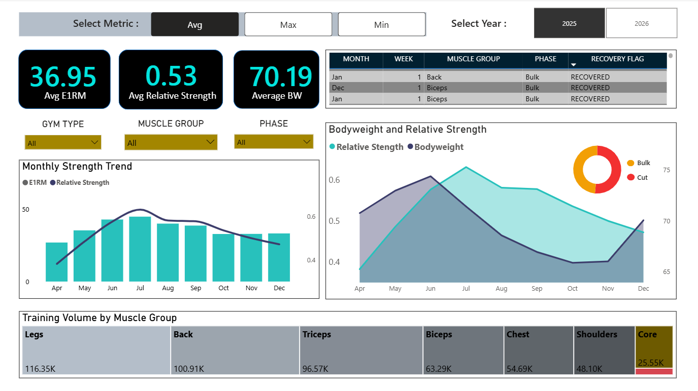

# Gym Performance Analytics

A data analytics pipeline that transforms raw WhatsApp workout logs into structured performance insights. The project covers the full lifecycle — text extraction, feature engineering, statistical testing, machine learning, SQL analysis, and an interactive Power BI dashboard.

**Dataset**: 2,398 set-level records | 86 exercises | 8 muscle groups | 11 months (Apr 2025 – Feb 2026)



---

## Table of Contents

- [Project Structure](#project-structure)
- [Data Pipeline](#data-pipeline)
- [Dashboard](#dashboard)
- [SQL Analysis](#sql-analysis)
- [Key Findings](#key-findings)
- [Tech Stack](#tech-stack)
- [Getting Started](#getting-started)
- [Data Dictionary](#data-dictionary)
- [License](#license)

---

## Project Structure

```
Workout Performance Analytics/
├── notebooks/
│   ├── 01_extract_whatsapp_logs.ipynb
│   ├── 02_feature_engineering.ipynb
│   ├── 03_weekly_aggregation.ipynb
│   └── 04_analysis.ipynb
├── dashboard/
│   ├── workout_dashboard.pbix
│   └── dashboard_overview.png
├── data/
│   ├── raw/
│   │   ├── bodyweight_log.xlsx
│   │   └── previous_training_log.xlsx
│   └── processed/
│       ├── workout_raw_extracted.csv
│       ├── feature_engineered_dataset.csv
│       └── workout_weekly_analysis.csv
└── sql/
    ├── Average relative strength by phase or muscle.sql
    ├── Avg strength by gym type.sql
    ├── Strength by Muscle Group from Weekly Data.sql
    ├── Under recovered weeks.sql
    └── Weekly total volume.sql
```

---

## Data Pipeline

The pipeline is split across four Jupyter notebooks, run sequentially.

### 1. Extract WhatsApp Logs

Parses a raw WhatsApp chat export using regex to pull out structured workout entries — date, exercise name, weight (kg), and reps. Filters messages containing set/rep patterns and handles edge cases like edited messages. Produces **1,035 rows** of set-level data.

**Output**: `workout_raw_extracted.csv`

### 2. Feature Engineering

Merges three data sources (WhatsApp-extracted logs, a prior training log with 1,363 rows, and 309 daily bodyweight entries) into a single dataset. Standardizes exercise names via an alias dictionary, then engineers the following features:

- **E1RM** — Estimated One-Rep Max using the Epley formula: `weight × (1 + reps / 30)`
- **Relative Strength** — E1RM normalized by bodyweight
- **Volume** — Total load per set: `weight × reps`
- **Muscle Group** — Each of the 86 exercises mapped to one of 8 groups
- **Phase** — Bulk or Cut, assigned by date range based on bodyweight trends
- **Gym Type** — College Gym or Soro Gym, assigned by date range

**Output**: `feature_engineered_dataset.csv` (2,398 rows, 13 columns)

### 3. Weekly Aggregation

Rolls up set-level data into 283 weekly summaries grouped by muscle group. Computes weekly averages for E1RM and relative strength, total volume, and week-over-week deltas. Flags recovery status using phase-aware rules:

- During **Bulk**: flagged as under-recovered if strength is not increasing
- During **Cut**: flagged as under-recovered if relative strength declines

**Output**: `workout_weekly_analysis.csv` (283 rows, 12 columns)

### 4. Analysis and Modelling

Runs statistical tests and builds predictive models on the weekly data:

- **Welch's t-test** comparing strength adaptation between Bulk and Cut phases — result: p = 0.362, not statistically significant
- **Cohen's d** effect size = 0.116 (negligible)
- **Logistic Regression** for predicting next-week strength drops — 59% accuracy, ROC-AUC 0.469
- **Random Forest** (300 trees, max depth 6) — 56% accuracy, ROC-AUC 0.584
- Top predictive features: prior week's E1RM (37.3%) and volume (35.2%)

---

## Dashboard

The Power BI dashboard (`workout_dashboard.pbix`) provides an interactive view with:

- **KPI cards** for average E1RM, relative strength, and bodyweight
- **Monthly strength trend** — dual-axis bar/line chart for E1RM and relative strength
- **Bodyweight vs. relative strength** — area chart with bulk/cut phase breakdown
- **Training volume by muscle group** — comparative breakdown across all 8 groups
- **Recovery table** — weekly recovery flags by muscle group and phase
- **Slicers** for gym type, muscle group, phase, year, and metric (avg / max / min)

---

## SQL Analysis

Five queries are included in the `sql/` directory, each with a corresponding screenshot of the output. All queries target the `weekly_workout` table.

| Query | What It Does |
|-------|--------------|
| Relative strength by phase and muscle | Averages relative strength for each muscle group, split by Bulk and Cut |
| Avg strength by gym type | Compares average E1RM between College Gym and Soro Gym |
| Strength by muscle group | Ranks all muscle groups by average E1RM, descending |
| Under-recovered weeks | Lists every week flagged as under-recovered, with muscle group and phase |
| Weekly total volume | Sums total training volume per week across all muscle groups |

---

## Key Findings

1. **Bulk vs. Cut makes no significant difference** to strength adaptation (p = 0.362, Cohen's d = 0.116). Training quality matters more than the phase.
2. **Prior week's E1RM and volume** are the strongest predictors of next-week strength drops, accounting for over 72% of feature importance in the Random Forest model.
3. **Legs and Back** receive the most training volume (116K and 101K respectively), reflecting compound movement emphasis.
4. **Core exercises** show the highest relative strength ratios (1.2–1.4x bodyweight) due to lower absolute loads.
5. **Zero under-recovered weeks** were flagged, suggesting well-managed training periodization across both phases.
6. **Bodyweight ranged from ~65 kg to ~75 kg** between cut and bulk phases, with relative strength peaking mid-cut.

---

## Tech Stack

| Layer | Tools |
|-------|-------|
| Data source | WhatsApp chat export (.txt), Excel spreadsheets (.xlsx) |
| Processing | Python, Pandas, NumPy |
| Extraction | Regex-based text parsing |
| Visualization | Matplotlib, Seaborn |
| Statistics | SciPy (Welch's t-test, Cohen's d) |
| Machine learning | Scikit-learn (Logistic Regression, Random Forest) |
| Dashboard | Microsoft Power BI |
| SQL | SQL Server / any compatible engine |

---

## Getting Started

### Prerequisites

- Python 3.8+
- Jupyter Notebook
- Power BI Desktop (for the dashboard)

### Setup

```bash
git clone https://github.com/<your-username>/workout-performance-analytics.git
cd workout-performance-analytics
pip install pandas numpy matplotlib seaborn scipy scikit-learn openpyxl jupyter
```

### Run

Open the notebooks in order:

```bash
jupyter notebook notebooks/
```

1. `01_extract_whatsapp_logs.ipynb`
2. `02_feature_engineering.ipynb`
3. `03_weekly_aggregation.ipynb`
4. `04_analysis.ipynb`

To explore the dashboard, open `dashboard/workout_dashboard.pbix` in Power BI Desktop.

---

## Data Dictionary

### Feature-Engineered Dataset

| Column | Description |
|--------|-------------|
| Date | Workout date |
| Exercise | Exercise name (standardized) |
| Sets | Number of sets |
| Reps | Repetitions per set |
| Weight | Weight used in kg |
| Muscle_Group | Target muscle group (8 categories) |
| E1RM | Estimated one-rep max |
| Bodyweight | Bodyweight on that date in kg |
| Relative_Strength | E1RM / Bodyweight |
| Volume | Weight x Reps |
| Phase | Bulk or Cut |
| Gym_Type | College Gym or Soro Gym |

### Weekly Aggregated Dataset

| Column | Description |
|--------|-------------|
| Week | ISO week number |
| Muscle_Group | Target muscle group |
| Avg_E1RM | Weekly average estimated 1RM |
| Avg_Relative_Strength | Weekly average relative strength |
| Total_Volume | Sum of training volume for the week |
| E1RM_Change | Week-over-week delta in E1RM |
| Strength_Trend | Increasing, Decreasing, or Stable |
| Recovery_Flag | Recovered or Under_Recovered |
| Phase | Bulk or Cut |
| Gym_Type | College Gym or Soro Gym |

---

## License

This project is open source and available under the [MIT License](LICENSE).
